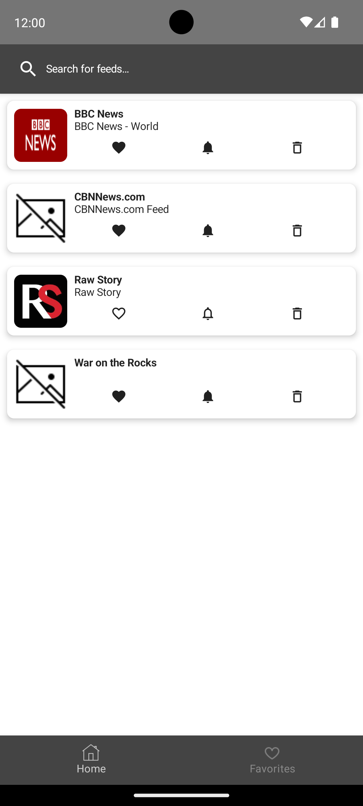
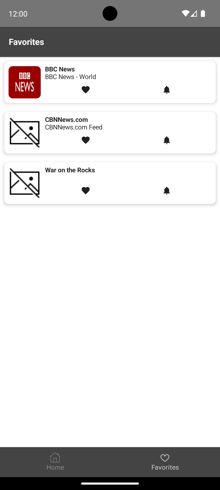
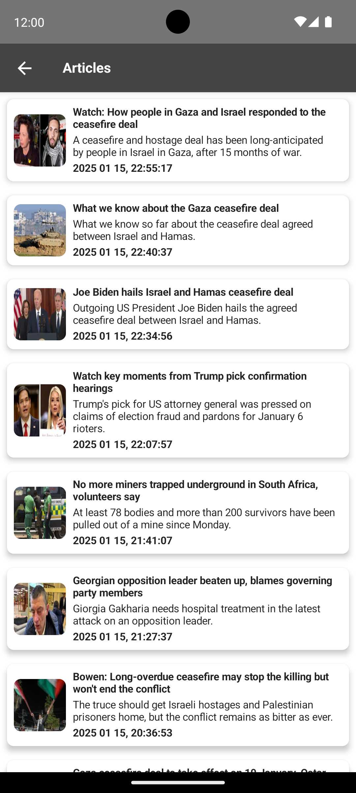

# RSSFeed
RSSFeed is a simple and intuitive app designed to manage and browse RSS feeds efficiently. The app allows users to subscribe, add/remove feeds, mark favorites, and view articles. It also provides notifications when new articles are available.

## Features

### RSS Feed List
You can add or remove feeds, mark them as favorites, and subscribe to receive notifications when new articles are available.

### RSS Feed List
View all your favorite feeds in one place.

### Articles Screen
Display all articles of a selected feed. Navigate to the browser directly from an article.

### Modules
Project is separated to following modules
- `app` - The presentation layer (UI components and interaction logic).
- `domain` - Contains the definitions of the business logic of the app, the domain models, the abstract definition of repositories, and the definition of the use cases
- `data` -  Responsible for data handling, including API calls, database management, and syncing logic.

## Libraries & Frameworks & Tools
Bellow is a list of important libraries used within the project
- Jetpack Compose
- Koin
- Ktor
- SQLDelight
- Arrow
- Gradle Convention Plugins
- Ktlint
- Detekt
- WorkManager
